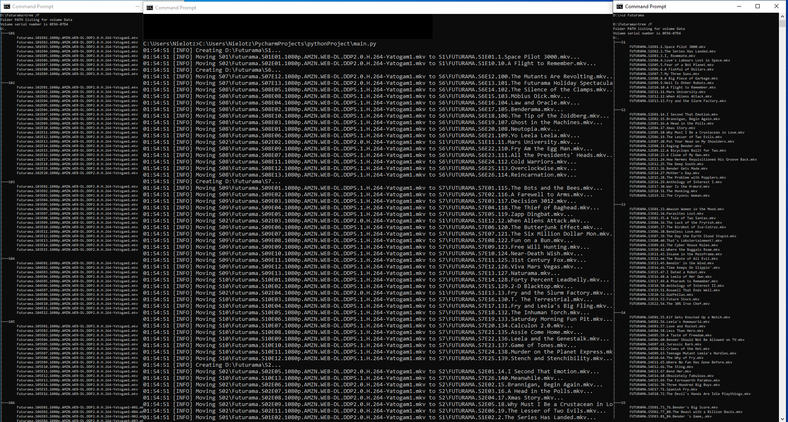

# RandomScripts
 
### TVSeriesOrderFixer - rename and move season episodes to fix order.
Uses season to organize in folders.

Setup: 
`SERIES_FOLDER_PATH = r"D:\Futurama"  # Path to folder with seasons folder.` 
`SERIES_NAME = "FUTURAMA"  # Used to createname filenames.` 
Organize episode episodes_data_from_explorer.key by using episode_data[global_episode_id] 
`episode_data = {global_episode_id: EpisodeData(end_id, season_id, season_episode_id, title), }`
`episodes_data_from_explorer = {existing_filename : global_episode_id}` 
You need to change 
`season_padded: str = old_episode_filename.split(".")[1].split("E")[0].upper()` to receive Seasonx folder name  
Series folder structure: 
MainCatalog 
|--Seasonx 
|--Seasony 
|--Seasonz 

