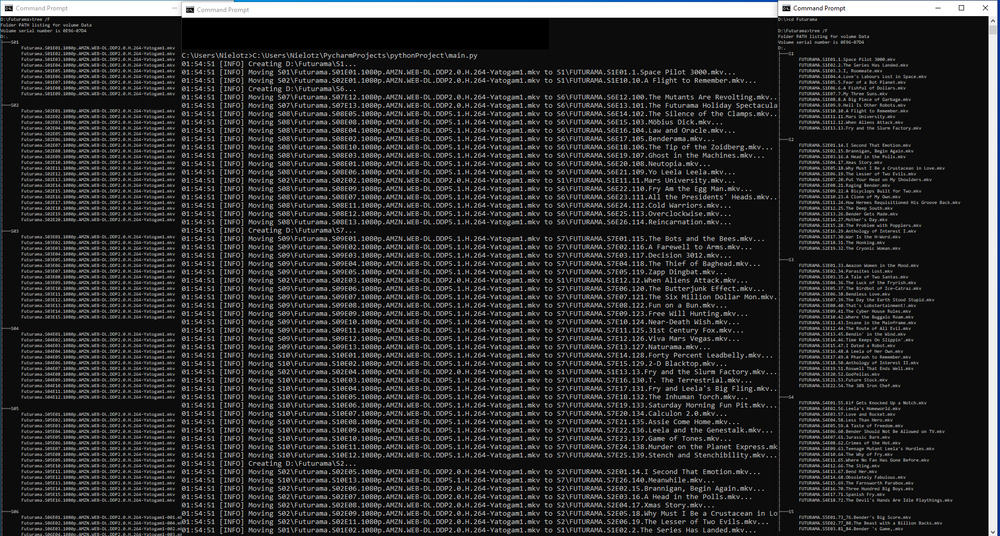

# TVSeriesOrderFixer 
<b>Rename and move season episodes to fix order. </b> 
Uses season number to organize in folders.

### Setup ([main.py](main.py)):
`SERIES_FOLDER_PATH = r"D:\Futurama"` - Path to folder with seasons folder. 
`SERIES_NAME = "FUTURAMA"` - Used to create filenames.

<b>You have to set `season_padded: str = old_episode_filename.split(".")[1].split("E")[0].upper()` 
to contain season name. It is used to create `SeasonX` folder</b>

Organizes episode `episodes_data_from_explorer.key` by using `episode_data[global_episode_id]`. 
`episode_data = {global_episode_id: EpisodeData(end_id, season_id, season_episode_id, title), }`
`episodes_data_from_explorer = {existing_filename : global_episode_id}` 

### Series folder structure: 
<pre>
MainCatalog
    |--SeasonX
    |    |--File
    |--SeasonY
    |--SeasonZ
</pre>

