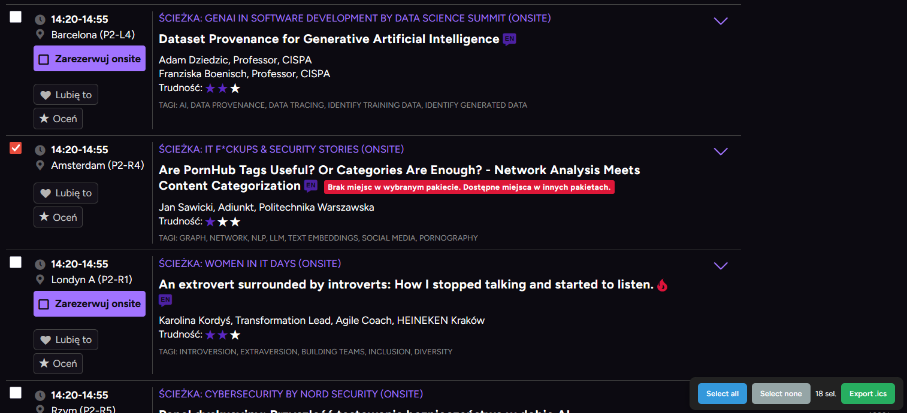

# WDI do kalendarza
1. Wejdź na stronę z wydarzeniami WDI.
2. Uruchom konsolę przeglądarki (F12 lub Ctrl+Shift+I).
3. Wklej [agenda-to-ics.js](agenda-to-ics.js) i naciśnij Enter.
    - skrypt doda do wydarzeń checkboxy, które pozwolą wybrać wydarzenia
4. Zaznacz wydarzenia, które chcesz dodać do kalendarza.
5. Naciśnij "Eksport .ics" — pobierze plik .ics z wybranymi wydarzeniami.

# Example
