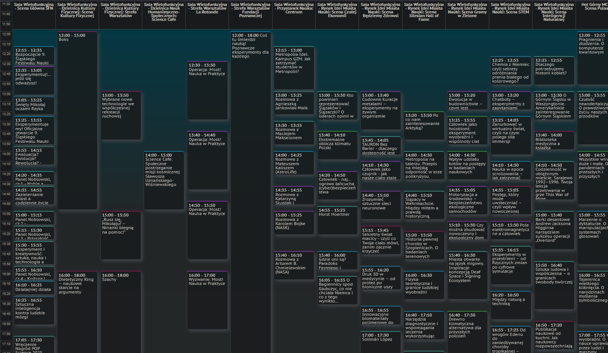
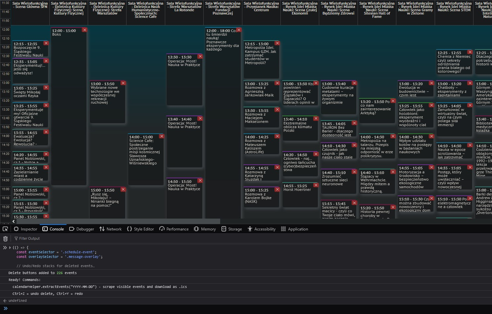
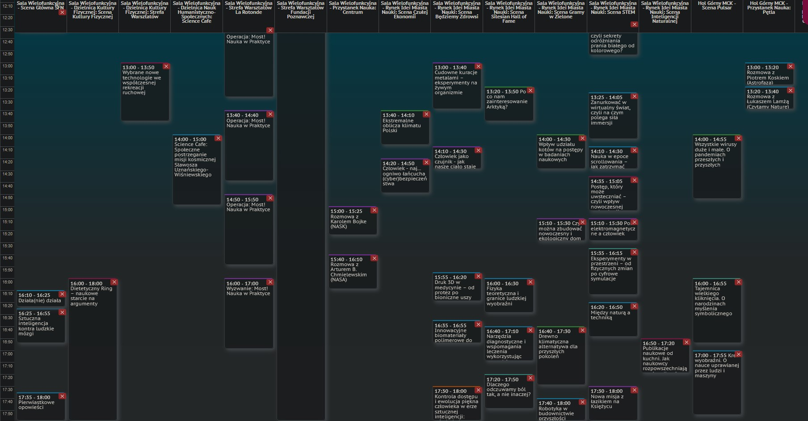
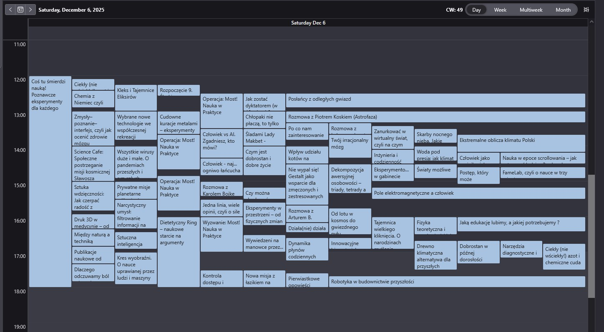

1. Wejdź na stronę https://slaskifestiwalnauki.pl/program
2. Wybierz dzień
3. Uruchom konsole przeglądarki (F12 lub Ctrl+Shift+I)
4. Wklej [util.js](util.js) naciśnij Enter:
   - skrypt doda do wydarzeń czerwony X, który pozwoli usunąć wydarzenie
   - obsługuje ctrl+z i ctrl+y
5. Pozostaw wydarzenia, które chcesz dodać do kalendarza
6. Wywołaj calendarHelper.extractEvents("YYYY-MM-DD"), który zapisze wybrane wydarzenia jako .ics, który można zaimportować do kalendarza

# Przykład

# Zastosowaniu skryptu

# Przefiltrowane wydarzenia

# Zaimportowane wydarzenia do kalendarza
